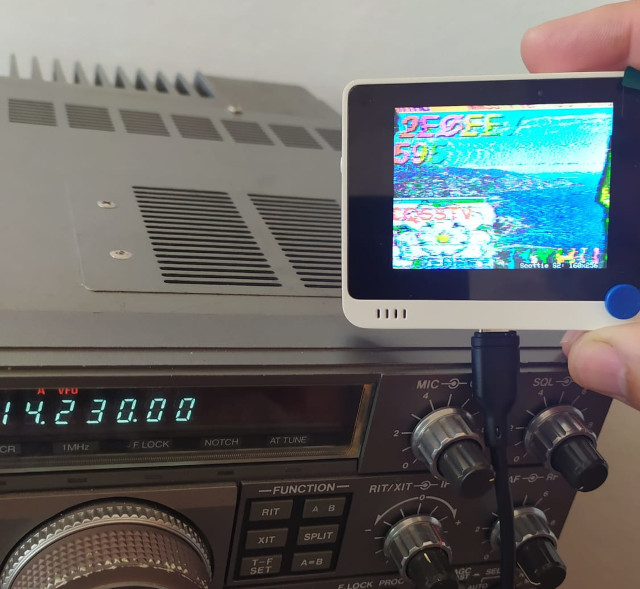

This is a sstv decoder for Seeed Wio Terminal based upon the library PicoSSTV of Jon Dawson 
https://github.com/dawsonjon/PicoSSTV.

Installation:
------------
+ Setup your arduino ide for Seeed Wio Terminal (https://wiki.seeedstudio.com/Wio-Terminal-Getting-Started/)
+ Unzip and copy the folder sstv_library into the Arduino libraries folder
+ Unzip and copy the other folder into the Arduino folder
+ Open the .ino file

That's all

Enjoy
Franciscu Capuzzi "Brabudu" IS0JSV
